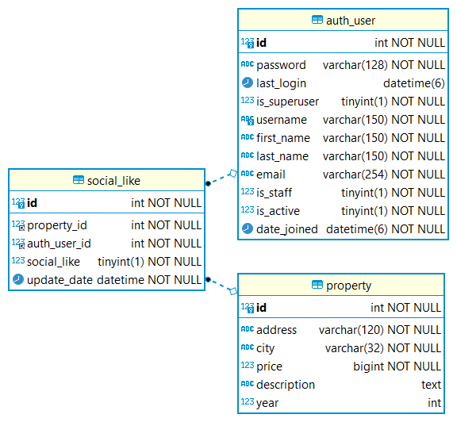

# Oscar Chamat | habi project

This repository contains my Test Project, thank you for taking the time to read this documentation.
If you want me to implement some new feature, fix something or give any further detail don't hesitate on reaching me at chamatoscar@gmail.com.

## Easy testing

The easiest way to test is to connect to the server provided in the email and follow [easy-testing.md](easy-testing.md)

## Installation
1) Assuming you have the repository cloned already
2) In linux run `sudo chmod -R 755 hproperties/*`

### Requirements
This is what you need to install in your computer

* `Docker` https://docs.docker.com/install
  — Install Docker for different operating system. See documentation.
* `Docker Compose` https://docs.docker.com/compose/install/
  — Install Docker Compose for macOS, Windows, and Linux

### Putting enviroment file .env

* Some configurations are dependant of the .env file. You need to rename the file [./.env.bk](./.env.bk)  to .env keeping them in their own respective directory.
* The database you specify in the .env needs to exist and have the same data of the testing database

### Testing the api-rest
1) To run the rest service just do -> `docker-compose up -d`

#### Testing the api rest

1) If you want to test in a visual manner here is the url to the project in postman -> [](https://app.getpostman.com/run-collection/20133860-18a61172-c285-4bf5-a479-27f30b2b8447?action=collection%2Ffork&collection-url=entityId%3D20133860-18a61172-c285-4bf5-a479-27f30b2b8447%26entityType%3Dcollection%26workspaceId%3Df735ffb6-febe-4ea6-8f6d-7e49d20691b1#?env%5Bhabi_rest%5D=W3sia2V5Ijoic2VydmVyIiwidmFsdWUiOiI0NC4yMDMuMTI3LjE5MiIsImVuYWJsZWQiOnRydWUsInR5cGUiOiJkZWZhdWx0Iiwic2Vzc2lvblZhbHVlIjoiNDQuMjAzLjEyNy4xOTIiLCJzZXNzaW9uSW5kZXgiOjB9XQ==)

    - You can also see some examples of the urls.
2) In general in the [](https://app.getpostman.com/run-collection/20133860-18a61172-c285-4bf5-a479-27f30b2b8447?action=collection%2Ffork&collection-url=entityId%3D20133860-18a61172-c285-4bf5-a479-27f30b2b8447%26entityType%3Dcollection%26workspaceId%3Df735ffb6-febe-4ea6-8f6d-7e49d20691b1#?env%5Bhabi_rest%5D=W3sia2V5Ijoic2VydmVyIiwidmFsdWUiOiI0NC4yMDMuMTI3LjE5MiIsImVuYWJsZWQiOnRydWUsInR5cGUiOiJkZWZhdWx0Iiwic2Vzc2lvblZhbHVlIjoiNDQuMjAzLjEyNy4xOTIiLCJzZXNzaW9uSW5kZXgiOjB9XQ==)
 you can see how to run the rest application with curl

3) You can also review the tests that you run with:
  `docker-compose run rest-service python -m pytest`
   
## Implementation
I implemented the test project as a union of a Rest Api in Flask and a frontend in Reactjs.

### Implemented Features
* Docker machines with an up to date installation.
* Docker compose files to make easier the use of Docker and the deployment.
* Design of the Database.
* Creation of the Rest Api in Flask with jwt token login.
* Creation of the Rest Api documentaion in postman to simplify testing.
* Creation of the tests of the Res Api in Flask to increase quality and understanding.
* Details; documentation, private variables and methods, custom error messages and providing tool to reduce the complexity of testing.

## Design
* There are two diagrams for easy modification: https://drive.google.com/file/d/17kkrtO9Zbq8PKwiK7um4zBZ57A9AYcXF/view?usp=sharing (but they have been generated in another tool)

### Data to send to the backend
* We expect you to send a variation this data to the url via GET parameters:
``` javascript
{
    'status': 3,
    'year': 2020,
    'city': 'bogota',
    'next': 0
}
```
* Which is in another words this url: `localhost:5000/property?status=3&year=2020&city=bogota&next=0`
  - The next parameter handles pagination and is optional (as all other parameters) 
### Like Functionality Entity Relationship diagram

* The like functionality is designed by creating a many-to-many table between the user table, and the property table that way assuring that a registered user can like a property.
* updated_date is added to help with data mining tasks although those can be leveraged from the logs. 
* The sql code is added in [like_table.sql](./sql/like_table.sql)
  
### Increasing speed/reducing query size Entity Relationship diagram

* To increase the speed we added a column in property that points to the last record in status_history for the property so that the sql interior query is reduce from the normal:
``` sql
select p.address, p.city, sh_max.status_id, p.price, p.description, p.year
from property p join 
    (select MAX(sh.update_date), sh.property_id, sh.status_id  
        from status_history sh group by sh.property_id 
    ) as sh_max
where p.id = sh_max.property_id 
    and sh_max.status_id in (3,4,5)
```
to
``` sql
select p.address, p.city, sh.status_id, 
    p.price, p.description, p.year,
    sh.update_date, sh.property_id, sh.status_id 
from property p join status_history  as sh
where p.last_status_history = sh.id 
    and sh.status_id in (3,4,5)
```
Which can lead to a big decrease in running time given that the status of a property can teoretically change a lot. 
* The sql code is added in [reduce_queries.sql](./sql/reduce_queries.sql)
  - Having in consideration the modification is done after some data exist in the database the NOT NULL constrain in the new column is avoided but is something the programmers must have in consideration.

## Extra notes
* Different notes of design provided in the file [minor-notes.md](minor-notes.md)

## Closing
Thanks for reading this far, I wish you a good day and I'm very looking forward to an interview with you.